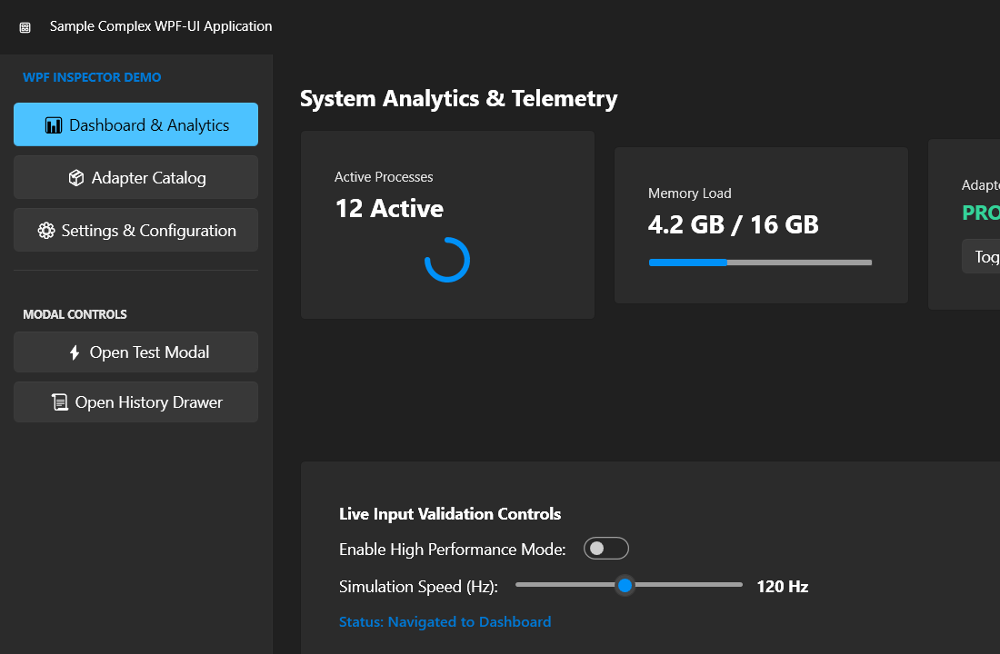

# 🔎 Komandio Labs WPF Inspector MCP

> Give AI coding agents a live, in-process view of your Windows WPF application.

Built by [Komandio Labs](https://www.komandio.com/), this open-source tool helps AI coding agents inspect, exercise, and validate Windows WPF applications.

[](https://www.microsoft.com/windows)
[](https://dotnet.microsoft.com/download/dotnet/10.0)
[](LICENSE.txt)

WPF Inspector MCP is a local [Model Context Protocol (MCP)](https://modelcontextprotocol.io/) server for inspecting and validating **real WPF applications**. It injects a trusted inspection agent into a running WPF process, giving an AI agent access to the live visual tree, logical tree, bindings, controls, windows, popups, screenshots, and carefully controlled interactions, without adding a reference to the target application.



## ✨ What it can do

- 🚀 Start a WPF executable and attach after its first window is ready, or attach to an existing local process by PID.
- 🌳 Inspect bounded **visual** and **logical** trees, including window roots and presentation surfaces such as popups.
- 🎯 Find elements by type, `Name`, `AutomationId`, or rendered text.
- 🧩 Inspect element properties, layout, data-context types, and local WPF binding expressions.
- 🕹️ List interactive controls and use semantic actions such as invoke, select, set text, toggle, focus, keyboard input, expand/collapse, and scroll.
- ⏳ Wait for UI states such as exists, visible, enabled, disabled, gone, hidden, or exact text.
- 🔁 Run short, bounded workflows made from interaction, wait, and assertion steps.
- 📸 Capture the actual managed window as MCP image content for visual validation.
- 🖱️ Click a window coordinate when a real mouse click is required.
- 🧹 End sessions safely, with different ownership behavior for launched and already-running applications.

## 🤔 Why this exists

Accessibility-only inspection tools expose the UI Automation tree. That is useful, but it can hide the details that matter when diagnosing a WPF application: template-generated elements, dependency properties, bindings, data contexts, logical ownership, and popup presentation roots.

Komandio Labs developed and uses WPF Inspector MCP to test its own WPF applications, including [Komandio](https://www.komandio.com/komandio/) and [Kontrol](https://www.komandio.com/kontrol/), with AI coding-agent harnesses such as [OpenAI Codex](https://openai.com/codex/) and [AGY](https://www.agy.dev/). It gives those agents a direct, structured view of the live application so they can help investigate behavior, verify UI state, and exercise real workflows during development.

WPF Inspector MCP runs its agent inside the target process and executes inspection on the WPF dispatcher:

```text
AI agent
   │
   ▼
MCP client ── stdio ──► WPF Inspector MCP
                            │
                            ▼
                 native x64 CoreCLR injector
                            │
                            ▼
                  target's existing CoreCLR
                            │
                            ▼
              authenticated named-pipe agent
```

The target application starts normally. The inspection agent is attached only after WPF has initialized and a visible window is available, which avoids interfering with application startup and resource initialization.

## 🧰 Requirements

- 🪟 Windows 10/11, 64-bit
- 🟣 .NET 10 SDK
- 🟦 .NET 8 Desktop Runtime when running the sample or integration tests locally
- 🛠️ Visual Studio 2022 or Build Tools with **Desktop development with C++** and the x64 C++ toolchain
- A target application built on CoreCLR (`.NET`), using WPF, running as a same-user, non-elevated x64 process
- The shipped inspection Agent targets `net8.0-windows`, so .NET 8 or newer WPF targets are the supported range
- .NET Framework 4.8 WPF applications are not supported by the current CoreCLR-based injector

The inspector is intended for local development and debugging. Use it only with applications you own or are authorized to inspect.

## ⚠️ Antivirus and binary trust

WPF Inspector MCP uses a **Snoop-style native DLL injection technique** to load the required inspection agent into a running WPF process, similar to how tools such as [Snoop](https://github.com/snoopwpf/snoopwpf) inspect WPF applications. This behavior is intentional and required for in-process inspection, but it can look suspicious to security software.

The binaries built from this repository are not code-signed. Antivirus and endpoint protection products, including Bitdefender, may therefore block or quarantine the MCP server, the native injector, or the inspection agent. Before using a binary:

- 🧪 Scan it with your local antivirus/EDR and, when appropriate, [VirusTotal](https://www.virustotal.com/). Do not upload proprietary or sensitive binaries to a public scanning service.
- 🔍 Review the source code in this repository so you can see exactly how the server, injector, named pipe, and agent work.
- 🛠️ For maximum confidence, clone this repository and build your own binaries.
- ✅ If your security product blocks a reviewed binary, add only the specific required executable/DLL as an exception before use, and only in an environment where you understand and accept the risk. Avoid broadly disabling antivirus protection.

This project does not ask you to trust an opaque prebuilt injector. Inspect, scan, and build from source whenever your security policy requires it.

## 🚀 Quick start

### Download a ready-to-run release

If you do not want to build the solution, download the latest [GitHub Release](https://github.com/komandio-labs/wpf-inspector-mcp/releases). Download `wpfinspectmcp.exe` and point your MCP client at that file. There is no extraction step.

Each release is a self-contained Windows x64 executable. The managed inspection agent and native injector are embedded in the executable and extracted transparently to a temporary folder only when an inspection session needs them. Releases are produced automatically when a version tag such as `v1.0.0` is pushed.

### 1. Build and test

From the repository root:

```powershell
dotnet restore KomandioLabs.WpfInspector.Mcp.sln
dotnet build KomandioLabs.WpfInspector.Mcp.sln --no-restore
dotnet test KomandioLabs.WpfInspector.Mcp.sln --no-build --no-restore
```

The build also compiles the native x64 injector and places it beside the MCP server output.

### 2. Publish the MCP server

Publishing creates a self-contained single executable that can be launched by an MCP client:

```powershell
dotnet publish src/KomandioLabs.WpfInspector.Mcp/KomandioLabs.WpfInspector.Mcp.csproj `
  --configuration Release `
  --runtime win-x64 `
  --self-contained true `
  -p:PublishSingleFile=true `
  -p:IncludeNativeLibrariesForSelfExtract=true `
  -p:EnableCompressionInSingleFile=true `
  --output publish/wpfinspectmcp
```

The output includes `wpfinspectmcp.exe`. The machine running it does not need the .NET 10 Desktop Runtime because the published executable is self-contained.

### 3. Configure your AI coding tool

Point your AI coding tool at `wpfinspectmcp.exe`. Use an absolute path. The release executable contains everything it needs and can be moved without carrying a separate bundle folder.

The examples below use this placeholder path:

```text
C:/Tools/wpf-inspector-mcp/wpfinspectmcp.exe
```

Replace it with the actual path on your computer.

#### Claude Code

Run this command in a terminal:

```powershell
claude mcp add --transport stdio --scope user wpf-inspector -- "C:\Tools\wpf-inspector-mcp\wpfinspectmcp.exe"
```

Check the connection with:

```text
claude mcp list
```

You can also run `/mcp` inside Claude Code to see the connected server and its tools. The `user` scope makes the server available in all your Claude Code projects. Use `--scope project` if you want to save the configuration in the current project instead.

#### Claude Desktop

Add the following entry to Claude Desktop's `claude_desktop_config.json`:

```json
{
  "mcpServers": {
    "wpf-inspector": {
      "type": "stdio",
      "command": "C:\\Tools\\wpf-inspector-mcp\\wpfinspectmcp.exe"
    }
  }
}
```

Restart Claude Desktop after saving the file.

#### Codex

The simplest option is to register the server from the Codex CLI:

```powershell
codex mcp add wpf-inspector -- "C:\Tools\wpf-inspector-mcp\wpfinspectmcp.exe"
```

Verify it with:

```text
codex mcp list
```

Codex stores this configuration in `%USERPROFILE%\.codex\config.toml`. You can also add it there manually:

```toml
[mcp_servers.wpf_inspector]
command = "C:\\Tools\\wpf-inspector-mcp\\wpfinspectmcp.exe"
```

The Codex CLI, IDE extension, and desktop app use the same MCP configuration.

#### AGY

AGY reads MCP servers from `%USERPROFILE%\.gemini\config\mcp_config.json` for a global setup. For a project-only setup, use `.agents\mcp_config.json` in the project folder.

Add this entry to the selected file:

```json
{
  "mcpServers": {
    "wpf-inspector": {
      "command": "C:/Tools/wpf-inspector-mcp/wpfinspectmcp.exe"
    }
  }
}
```

Restart AGY, then use `/mcp` to check the server status.

#### Generic MCP configuration

Other MCP clients can use the same stdio configuration. Use forward slashes or escaped backslashes in JSON:

```json
{
  "mcpServers": {
    "wpf-inspector": {
      "command": "C:/Tools/wpf-inspector-mcp/wpfinspectmcp.exe"
    }
  }
}
```

The server communicates over stdio. Its standard output is reserved for MCP protocol messages; diagnostic logs go to standard error.

## 🧭 Typical inspection workflow

1. Start the target WPF application normally, or identify the PID of an already-running local app.
2. Call `start_wpf_inspection` with an absolute `.exe` path, or call `attach_wpf_inspection` with the exact PID.
3. Discover the app with `get_inspection_windows`, `get_wpf_roots`, and `get_wpf_surfaces`.
4. Use `find_wpf_elements` to locate a control, then follow its `v:` or `l:` node ID into `get_visual_tree`, `get_logical_tree`, `get_wpf_element_details`, or `get_wpf_bindings`.
5. Capture a screenshot when you need visual confirmation of the rendered state.
6. Ask the user for confirmation immediately before any state-changing interaction or real mouse click.
7. Call `end_wpf_inspection` when finished.

Started applications are closed when their session ends or when the MCP server exits. An application attached by PID is left running when the session ends.

## 🧩 MCP tools

| Area | Tools |
| --- | --- |
| Session | `start_wpf_inspection` · `attach_wpf_inspection` · `end_wpf_inspection` · `get_inspection_windows` |
| Discovery | `get_wpf_roots` · `get_wpf_surfaces` · `get_visual_tree` · `get_logical_tree` · `find_wpf_elements` |
| Diagnostics | `get_wpf_element_details` · `get_wpf_bindings` · `get_wpf_interactive_elements` |
| Interaction | `interact_with_wpf_element` · `wait_for_wpf_state` · `run_wpf_workflow` |
| Visual validation | `take_inspection_screenshot` · `click_inspection_window_point` |

### Semantic actions

`interact_with_wpf_element` supports `auto`, `invoke`, `select`, `setText`, `setRangeValue`, `toggle`, `focus`, `sendKey`, `expand`, `collapse`, and `scroll`.

For a `ScrollViewer`, scrolling accepts directions such as `lineDown`, `pageDown`, `top`, and `bottom`, or an absolute offset such as `vertical:240`.

### Bounded inspection

Tree calls are intentionally bounded. Begin with the roots, then request a focused subtree using the returned node ID. Tree depth is limited to 8, direct children to 250, and workflows to 25 steps so a large application does not overwhelm the MCP conversation.

## 🛡️ Safety model

- 🔒 Inspection sessions use a fresh random named-pipe name and 256-bit session secret.
- 📍 PID-based attach requires an explicit local process ID; callers cannot provide arbitrary agent DLL paths.
- 🏷️ Inspected windows are marked with an `[AI inspection]` title prefix while the session is active.
- ✅ State-changing semantic actions, workflows, and real mouse clicks require immediate user confirmation.
- 🧯 The temporary native injector is unloaded after activation. Ending an attached session stops the agent service without unsafe managed-assembly unloading.
- 👤 The target application owner remains responsible for authorization and for reviewing any requested interaction.

## 📁 Repository layout

```text
src/KomandioLabs.WpfInspector.Mcp/              MCP server and session management
src/KomandioLabs.WpfInspector.Agent/           injected WPF inspection agent
src/KomandioLabs.WpfInspector.NativeInjector/ temporary native CoreCLR injector
samples/KomandioLabs.WpfInspector.Sample/     WPF-UI sample application
tests/KomandioLabs.WpfInspector.Mcp.Tests/      unit and end-to-end tests
docs/assets/                      README images
```

## 🧪 Sample application

The solution includes `KomandioLabs.WpfInspector.Sample`, a small WPF-UI application with navigation, dialogs, a drawer, bindings, scrolling, and interactive controls. It provides a safe target for trying the inspector locally and for running the integration tests.

Build it with the solution:

```powershell
dotnet build KomandioLabs.WpfInspector.Mcp.sln --configuration Debug
```

Then launch the sample executable from its build output and connect the MCP server to it.

## 🤝 Contributing

Issues, pull requests, and ideas are welcome. When reporting a problem, please include your Windows version, .NET SDK version, target WPF runtime/architecture, and the MCP tool call that failed.

## ☕ Support Komandio Labs

I am an independent developer, and your support helps me maintain open source projects, improve documentation, publish releases, and keep building useful tools for developers and players.

[](https://ko-fi.com/komandiolabs)

## 📄 License

This project is distributed under the [Microsoft Public License (MS-PL)](LICENSE.txt). See [THIRD_PARTY_NOTICES.md](THIRD_PARTY_NOTICES.md) for required attribution and trademark information.
